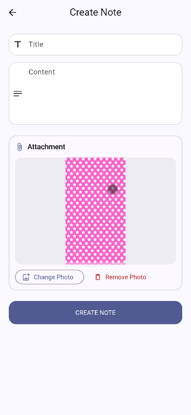
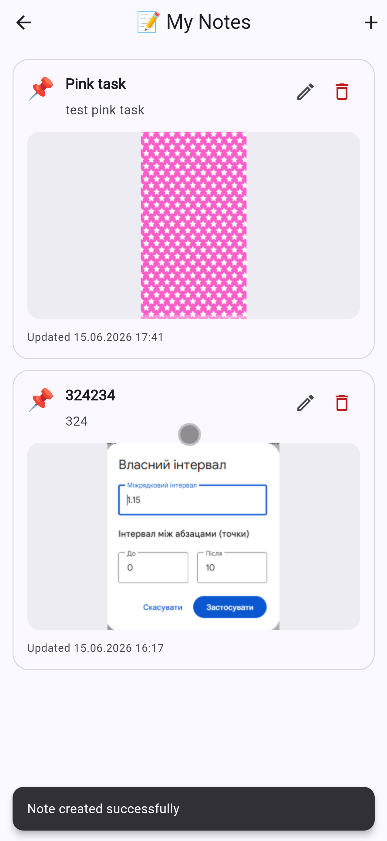
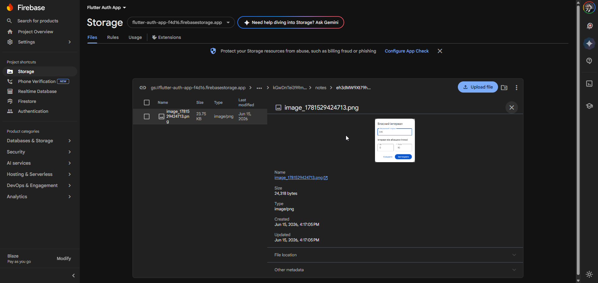

# 🔐🔥📦 Firebase Authentication + Firestore Notes App

Виконав: Маринич Данило

---

## 📌 Про проєкт

Це Flutter-додаток для роботи з Firebase. У проєкті реалізовано три лабораторні роботи:

* **Лабораторна робота №16:** Firebase Authentication.
* **Лабораторна робота №17:** Firebase Firestore Database / Notes App.
* **Лабораторна робота №18:** Firebase Storage.

Користувач реєструється або входить через Firebase Authentication. Після входу він може створювати власні нотатки, які зберігаються у Firestore, а також прикріплювати до них фото через Firebase Storage.

---

# 🔐 Лабораторна робота №16: Firebase Authentication

## ✅ Що реалізовано

* ✅ Firebase-проєкт підключено до Flutter-додатку.
* ✅ Налаштовано FlutterFire CLI.
* ✅ Реалізовано Sign Up.
* ✅ Реалізовано Login.
* ✅ Реалізовано Logout з підтвердженням.
* ✅ Реалізовано Password Reset через email.
* ✅ Реалізовано Auth State Listener через `authStateChanges()`.
* ✅ Реалізовано Protected Route.
* ✅ Реалізовано обробку `FirebaseAuthException`.

---

## 🔑 Основний функціонал LR16

### Реєстрація

Користувач вводить ім’я, email, password і confirm password. Дані перевіряються через `Validators`. Після успішної реєстрації створюється Firebase user через `createUserWithEmailAndPassword`, а ім’я користувача зберігається через `updateDisplayName`.

### Вхід

Користувач входить через email і password. Після успішного входу ручна навігація на Home не потрібна, бо `AuthGate` автоматично відкриває `HomeScreen`.

### Вихід

На `HomeScreen` є кнопка logout. Перед виходом відкривається `AlertDialog`, після підтвердження викликається `signOut()`.

### Відновлення паролю

На `ForgotPasswordScreen` користувач вводить email, після чого Firebase надсилає password reset link.

### Protected Route

`AuthGate` слухає `FirebaseAuth.instance.authStateChanges()` і показує `LoginScreen` або `HomeScreen` залежно від стану авторизації.

---

## 📸 Скріншоти LR16

| Login | Sign Up | Валідація |
| --- | --- | --- |
|  |  |  |

| Home | Logout dialog | Forgot Password |
| --- | --- | --- |
|  |  |  |

| Reset success | Reset email | Firebase Users |
| --- | --- | --- |
|  |  |  |

---

# 🔥 Лабораторна робота №17: Firebase Firestore Database

## 📌 Про LR17

У цій лабораторній роботі до готової авторизації з LR16 додано **Notes App** з Firebase Firestore backend.

Користувач після входу може:

* створювати нотатки;
* переглядати нотатки в real-time;
* редагувати нотатки;
* видаляти нотатки;
* бачити тільки свої дані.

Firestore використовується як NoSQL cloud database, а дані кожного користувача зберігаються окремо.

---

## ✅ Виконані вимоги LR17

* ✅ Firestore setup.
* ✅ Додано `cloud_firestore`.
* ✅ Реалізовано `Note` model з `fromJson`, `toJson`, `copyWith`.
* ✅ Реалізовано Create note.
* ✅ Реалізовано Read notes через `StreamBuilder`.
* ✅ Реалізовано Update note.
* ✅ Реалізовано Delete note.
* ✅ Реалізовано user-specific data через `users/{userId}/notes`.
* ✅ Реалізовано real-time UI updates через `snapshots()`.
* ✅ Реалізовано timestamps через `FieldValue.serverTimestamp()`.
* ✅ Додано Firestore Security Rules.
* ⭐ Pagination не реалізовано, бо це опціональна частина.

---

## 🧱 Архітектура проєкту

```text
lib/
  main.dart
  firebase_options.dart

  core/
    theme.dart
    utils/
      validators.dart
      auth_error_mapper.dart
      date_formatter.dart
      snack_bar_helper.dart

  features/
    auth/
      services/
        auth_service.dart
      providers/
        auth_provider.dart
      screens/
        login_screen.dart
        sign_up_screen.dart
        forgot_password_screen.dart
      widgets/
        auth_text_field.dart
        password_text_field.dart
        auth_submit_button.dart
      auth_gate.dart

    home/
      screens/
        home_screen.dart
        profile_screen.dart

    notes/
      models/
        note.dart
      services/
        notes_service.dart
        storage_service.dart
      providers/
        notes_provider.dart
      screens/
        notes_screen.dart
        note_form_screen.dart
      widgets/
        note_card.dart
        empty_notes_view.dart
        note_image_picker_section.dart
```

`features/auth/` — логіка авторизації з LR16.

`features/home/` — захищені екрани після входу.

`features/notes/` — частина LR17/LR18 для роботи з нотатками, Firestore і Storage.

`NotesService` — інкапсулює роботу з Firestore: create, read stream, update, delete.

`StorageService` — інкапсулює роботу з Firebase Storage: upload image, get download URL, delete image.

`NotesProvider` — зберігає loading state, upload progress і викликає service-класи.

`NotesScreen` — показує список нотаток через `StreamBuilder`.

---

## 🔥 Firestore структура

Дані зберігаються за структурою:

```text
users
  └── {userId}
      └── notes
          └── {noteId}
              ├── title
              ├── content
              ├── userId
              ├── createdAt
              └── updatedAt
```

Глобальна колекція `notes` не використовується. Завдяки цьому кожен користувач бачить тільки власні нотатки.

---

## 🔑 Основний функціонал LR17

### Create note

Користувач відкриває `My Notes`, натискає `+`, вводить title і content. Після валідації нотатка створюється у Firestore через `NotesService.createNote()`.

### Read notes

Нотатки читаються через:

```dart
StreamBuilder<List<Note>>
```

У `NotesService` використовується Firestore `.snapshots()`, тому список оновлюється в реальному часі.

### Update note

Кнопка edit відкриває `NoteFormScreen(note: note)`. Після збереження оновлюються `title`, `content` і `updatedAt`.

### Delete note

Кнопка delete відкриває confirmation dialog. Після підтвердження документ видаляється з Firestore.

### User-specific data

`NotesService` бере поточного користувача через `FirebaseAuth.instance.currentUser` і працює тільки з його шляхом:

```text
users/{userId}/notes/{noteId}
```

### Real-time updates

Після create/update/delete UI оновлюється автоматично через `snapshots()`, без ручного оновлення списку.

---

## 🔐 Firestore Security Rules

Файл правил:

```text
firestore.rules
```

Rules:

```js
rules_version = '2';

service cloud.firestore {
  match /databases/{database}/documents {
    match /users/{userId}/notes/{noteId} {
      allow read, write: if request.auth != null
        && request.auth.uid == userId;
    }
  }
}
```

Ці правила потрібно додати у Firebase Console:

```text
Firestore Database → Rules
```

---

## 📸 Скріншоти LR17

### Firestore Database enabled


### Empty notes screen


### Create note


### Notes list


### Edit note


### Delete dialog


---

# 📦 Лабораторна робота №18: Firebase Storage

## 📌 Про LR18

У цій лабораторній роботі Notes App розширено можливістю прикріплювати фото до нотаток.

Фото вибирається з галереї через `image_picker`, завантажується у Firebase Storage, після чого download URL і metadata зберігаються у Firestore-документі нотатки. Якщо нотатку видалити, прикріплене фото також видаляється зі Storage.

---

## ✅ Виконані вимоги LR18

* ✅ Firebase Storage setup.
* ✅ Upload image через `image_picker`.
* ✅ Get download URL.
* ✅ Save URL to Firestore.
* ✅ Display image from URL.
* ✅ Upload progress indicator.
* ✅ Delete image from Storage.
* ✅ File size validation max 5MB.
* ✅ Metadata: contentType, size, userId, noteId.
* ✅ Integration with Firestore Notes.

---

## 📁 Storage structure

Файли зберігаються у Firebase Storage за user-specific шляхом:

```text
users
  └── {userId}
      └── notes
          └── {noteId}
              └── image_{timestamp}.jpg
```

Для PNG-файлів використовується розширення `.png`, а `contentType` зберігається як `image/png`.

---

## 🔥 Firestore note document

Після додавання фото документ нотатки має такі поля:

```text
users/{userId}/notes/{noteId}
  ├── title
  ├── content
  ├── userId
  ├── createdAt
  ├── updatedAt
  ├── imageUrl
  ├── imagePath
  ├── imageSize
  └── imageContentType
```

`imageUrl` використовується для показу фото через `Image.network`, а `imagePath` потрібен для надійного видалення файлу зі Storage.

---

## 🔑 Основний функціонал LR18

### Pick image

У `NoteFormScreen` користувач може натиснути `Add Photo` і вибрати зображення з галереї. Для цього використовується `image_picker`.

### File size validation

Перед upload перевіряється розмір файлу. Максимальний розмір:

```text
5MB
```

Якщо файл більший, користувач бачить повідомлення `Image is too large. Maximum size is 5MB.`.

### Upload image

`StorageService.uploadNoteImage()` завантажує файл у Firebase Storage за шляхом:

```text
users/{userId}/notes/{noteId}/image_{timestamp}.jpg
```

Під час upload у формі показується `LinearProgressIndicator`.

### Save URL to Firestore

Після upload сервіс отримує download URL через `getDownloadURL()`. Далі `NotesService.updateNoteImage()` записує у Firestore:

* `imageUrl`;
* `imagePath`;
* `imageSize`;
* `imageContentType`;
* `updatedAt`.

### Display image

`NoteCard` показує прикріплене фото через `Image.network`, якщо у нотатки є `imageUrl`.

### Delete image

При remove/replace/delete note старий файл видаляється зі Storage через `imagePath`. Якщо файл уже не існує, застосунок не падає.

---

## 🔐 Storage Rules

Файл правил:

```text
storage.rules
```

Rules:

```js
rules_version = '2';

service firebase.storage {
  match /b/{bucket}/o {
    match /users/{userId}/notes/{noteId}/{fileName} {
      allow read: if request.auth != null
        && request.auth.uid == userId;

      allow create, update: if request.auth != null
        && request.auth.uid == userId
        && request.resource.size < 5 * 1024 * 1024
        && request.resource.contentType.matches('image/.*');

      allow delete: if request.auth != null
        && request.auth.uid == userId;
    }
  }
}
```

Ці правила потрібно додати у Firebase Console:

```text
Firebase Console → Storage → Rules
```

---

## 📸 Скріншоти LR18

### Add photo to note


### Note with image


### Firestore



---

## ⚙️ Використані технології

* Flutter
* Dart
* Firebase Core
* Firebase Authentication
* Cloud Firestore
* Firebase Storage
* FlutterFire CLI
* Provider
* Image Picker
* Material 3

---

## ▶️ Як запустити проєкт

Встановити залежності:

```bash
flutter pub get
```

Запустити додаток:

```bash
flutter run
```

Якщо після зміни Firebase-конфігурації або залежностей виникають проблеми:

```bash
flutter clean
flutter pub get
flutter run
```

Firebase config-файли не комітяться у репозиторій. Їх потрібно згенерувати локально:

```bash
flutterfire configure --project=flutter-auth-app-f4d16
```

Після цієї команди мають з’явитися:

```text
lib/firebase_options.dart
android/app/google-services.json
ios/Runner/GoogleService-Info.plist
```

Перед запуском у Firebase Console потрібно перевірити:

```text
Authentication → Sign-in method → Email/Password
Firestore Database
Storage
```

---

## 🔍 Як перевірити роботу

1. Запустити додаток.
2. Зареєструватися або увійти.
3. Відкрити `My Notes`.
4. Створити нотатку без фото.
5. Створити нотатку з фото.
6. Перевірити, що фото завантажилось у Firebase Storage.
7. Перевірити, що `imageUrl` і `imagePath` збереглись у Firestore note document.
8. Перевірити, що фото показується в нотатці.
9. Відредагувати нотатку і замінити фото.
10. Видалити фото з нотатки.
11. Видалити нотатку і перевірити, що image також видалився зі Storage.
12. Увійти під іншим користувачем і перевірити, що нотатки першого користувача не видно.
13. Спробувати файл більше 5MB і перевірити validation.
14. Перевірити Firestore Rules і Storage Rules.

---

## 🧪 Перевірка коду

Запустити статичний аналіз:

```bash
flutter analyze
```

Поточний результат:

```text
flutter analyze
No issues found
```

Запустити тести:

```bash
flutter test
```

Тести запускаються для базової перевірки валідаторів, мапінгу auth-помилок і моделі нотатки. Основний акцент LR18 зроблено на Firebase Storage flow.

---

## 🛠️ Технічні рішення

### Чому використано Firebase Storage?

Firebase Storage дозволяє зберігати файли користувача окремо від Firestore. У Firestore зберігаються тільки URL, шлях до файлу і metadata.

### Чому URL зберігається у Firestore?

`imageUrl` потрібен для швидкого показу фото в UI через `Image.network`, а `imagePath` потрібен для видалення файлу зі Storage.

### Чому Storage-логіка винесена в StorageService?

Так UI не працює напряму з `FirebaseStorage`, а вся логіка upload/delete зібрана в одному service-класі.

### Як реалізовано user-specific storage?

Файл завантажується тільки в папку поточного користувача:

```text
users/{userId}/notes/{noteId}
```

Storage Rules перевіряють, що `request.auth.uid == userId`.

---

## ✅ Чеклист здачі

* ✅ Firebase Authentication з LR16 працює.
* ✅ Firestore Notes App з LR17 працює.
* ✅ Firebase Storage підключено.
* ✅ `firebase_storage` додано.
* ✅ `image_picker` додано.
* ✅ Upload image працює.
* ✅ Download URL зберігається у Firestore.
* ✅ Фото показується у нотатці.
* ✅ Upload progress реалізовано.
* ✅ File size validation 5MB реалізовано.
* ✅ Delete image from Storage реалізовано.
* ✅ Firestore Rules додано.
* ✅ Storage Rules додано.
* ✅ `flutter analyze` перевірено.
* ✅ README оформлено.

---

## 📌 Висновок

У результаті виконання LR16 було реалізовано Firebase Authentication, у LR17 додано Notes App з Firestore backend, а в LR18 застосунок розширено роботою з Firebase Storage. Тепер користувач може створювати власні нотатки, додавати до них фото, бачити оновлення в реальному часі та працювати тільки зі своїми даними.
