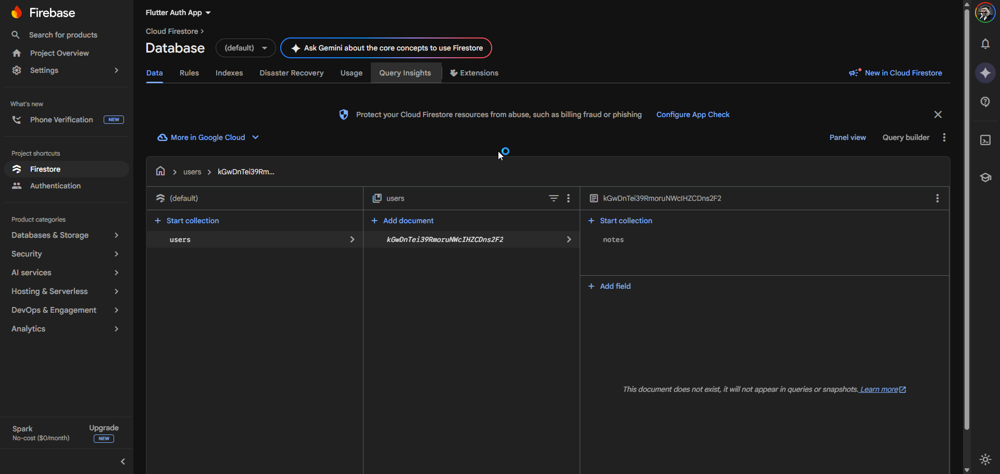
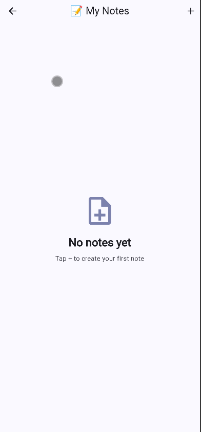
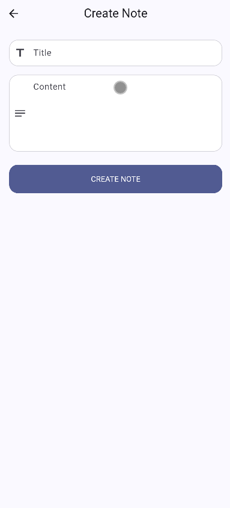
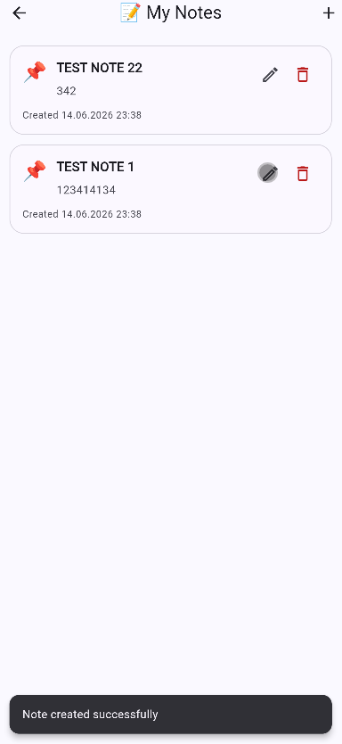
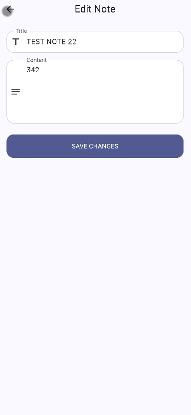
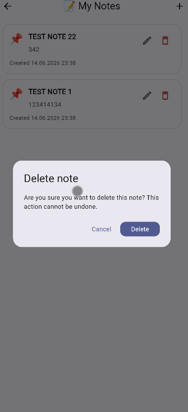

# 🔐🔥 Firebase Authentication + Firestore Notes App

Виконав: Маринич Данило

---

## 📌 Про проєкт

Це Flutter-додаток для роботи з Firebase. У проєкті реалізовано дві лабораторні роботи:

* **Лабораторна робота №16:** Firebase Authentication.
* **Лабораторна робота №17:** Firebase Firestore Database / Notes App.

Спочатку користувач реєструється або входить через Firebase Authentication. Після входу він може відкривати захищені екрани та працювати зі своїми нотатками, які зберігаються у Firebase Firestore.

---

# 🔐 Лабораторна робота №16: Firebase Authentication

## ✅ Що реалізовано

* ✅ Firebase-проєкт підключено до Flutter-додатку.
* ✅ Налаштовано FlutterFire CLI.
* ✅ Реалізовано Sign Up.
* ✅ Реалізовано Login.
* ✅ Реалізовано Logout з підтвердженням.
* ✅ Реалізовано Password Reset через email.
* ✅ Реалізовано Auth State Listener через `authStateChanges()`.
* ✅ Реалізовано Protected Route.
* ✅ Реалізовано обробку `FirebaseAuthException`.

---

## 🔑 Основний функціонал LR16

### Реєстрація

Користувач вводить ім’я, email, password і confirm password. Дані перевіряються через `Validators`. Після успішної реєстрації створюється Firebase user через `createUserWithEmailAndPassword`, а ім’я користувача зберігається через `updateDisplayName`.

### Вхід

Користувач входить через email і password. Після успішного входу ручна навігація не потрібна, бо `AuthGate` автоматично відкриває `HomeScreen`.

### Вихід

На `HomeScreen` є кнопка logout. Перед виходом відкривається `AlertDialog`, після підтвердження викликається `signOut()`.

### Відновлення паролю

На `ForgotPasswordScreen` користувач вводить email, після чого Firebase надсилає password reset link.

### Protected Route

`AuthGate` слухає `FirebaseAuth.instance.authStateChanges()` і показує `LoginScreen` або `HomeScreen` залежно від стану авторизації.

---

## 📸 Скріншоти LR16

| Login | Sign Up | Валідація |
| --- | --- | --- |
|  |  |  |

| Home | Logout dialog | Forgot Password |
| --- | --- | --- |
|  |  |  |

| Reset success | Reset email | Firebase Users |
| --- | --- | --- |
|  |  |  |

---

# 🔥 Лабораторна робота №17: Firebase Firestore Database

## 📌 Про LR17

У цій лабораторній роботі до вже готової авторизації з LR16 додано **Notes App** з Firebase Firestore backend.

Користувач після входу може:

* створювати нотатки;
* переглядати нотатки в real-time;
* редагувати нотатки;
* видаляти нотатки;
* бачити тільки свої дані.

Firestore використовується як NoSQL cloud database, а дані кожного користувача зберігаються окремо.

---

## ✅ Виконані вимоги LR17

* ✅ Firestore setup.
* ✅ Додано `cloud_firestore`.
* ✅ Реалізовано `Note` model з `fromJson`, `toJson`, `copyWith`.
* ✅ Реалізовано Create note.
* ✅ Реалізовано Read notes через `StreamBuilder`.
* ✅ Реалізовано Update note.
* ✅ Реалізовано Delete note.
* ✅ Реалізовано user-specific data через `users/{userId}/notes`.
* ✅ Реалізовано real-time UI updates через `snapshots()`.
* ✅ Реалізовано timestamps через `FieldValue.serverTimestamp()`.
* ✅ Додано Firestore Security Rules.
* ⭐ Pagination не реалізовано, бо це опціональна частина.

---

## 🧱 Архітектура проєкту

```text
lib/
  main.dart
  firebase_options.dart

  core/
    theme.dart
    utils/
      validators.dart
      auth_error_mapper.dart
      date_formatter.dart
      snack_bar_helper.dart

  features/
    auth/
      services/
        auth_service.dart
      providers/
        auth_provider.dart
      screens/
        login_screen.dart
        sign_up_screen.dart
        forgot_password_screen.dart
      widgets/
        auth_text_field.dart
        password_text_field.dart
        auth_submit_button.dart
      auth_gate.dart

    home/
      screens/
        home_screen.dart
        profile_screen.dart

    notes/
      models/
        note.dart
      services/
        notes_service.dart
      providers/
        notes_provider.dart
      screens/
        notes_screen.dart
        note_form_screen.dart
      widgets/
        note_card.dart
        empty_notes_view.dart
```

`features/auth/` — логіка авторизації з LR16.

`features/home/` — захищені екрани після входу.

`features/notes/` — нова частина LR17 для роботи з Firestore Notes.

`NotesService` — інкапсулює роботу з Firestore: create, read stream, update, delete.

`NotesProvider` — зберігає loading state та викликає `NotesService`.

`NotesScreen` — показує список нотаток через `StreamBuilder`.

---

## 🔥 Firestore структура

Дані зберігаються за структурою:

```text
users
  └── {userId}
      └── notes
          └── {noteId}
              ├── title
              ├── content
              ├── userId
              ├── createdAt
              └── updatedAt
```

Глобальна колекція `notes` не використовується. Завдяки цьому кожен користувач бачить тільки власні нотатки.

---

## 🔑 Основний функціонал LR17

### Create note

Користувач відкриває `My Notes`, натискає `+`, вводить title і content. Після валідації нотатка створюється у Firestore через `NotesService.createNote()`.

### Read notes

Нотатки читаються через:

```dart
StreamBuilder<List<Note>>
```

У `NotesService` використовується Firestore `.snapshots()`, тому список оновлюється в реальному часі.

### Update note

Кнопка edit відкриває `NoteFormScreen(note: note)`. Після збереження оновлюються `title`, `content` і `updatedAt`.

### Delete note

Кнопка delete відкриває confirmation dialog. Після підтвердження документ видаляється з Firestore.

### User-specific data

`NotesService` бере поточного користувача через `FirebaseAuth.instance.currentUser` і працює тільки з його шляхом:

```text
users/{userId}/notes/{noteId}
```

### Real-time updates

Після create/update/delete UI оновлюється автоматично через `snapshots()`, без ручного оновлення списку.

---

## 🔐 Firestore Security Rules

Файл правил:

```text
firestore.rules
```

Rules:

```js
rules_version = '2';

service cloud.firestore {
  match /databases/{database}/documents {
    match /users/{userId}/notes/{noteId} {
      allow read, write: if request.auth != null
        && request.auth.uid == userId;
    }
  }
}
```

Ці правила потрібно додати у Firebase Console:

```text
Firestore Database → Rules
```

---

## 📸 Скріншоти LR17

Для LR17 потрібно додати скріншоти в папку `screenshots/` з такими назвами:

```text
10_firestore_enabled.png
11_empty_notes.png
12_create_note.png
13_notes_list.png
14_edit_note.png
15_delete_dialog.png
16_firestore_structure.png
17_firestore_rules.png
```

### Firestore Database enabled


### Empty notes screen


### Create note


### Notes list


### Edit note


### Delete dialog

---

## ⚙️ Використані технології

* Flutter
* Dart
* Firebase Core
* Firebase Authentication
* Cloud Firestore
* FlutterFire CLI
* Provider
* Material 3

---

## ▶️ Як запустити проєкт

Встановити залежності:

```bash
flutter pub get
```

Запустити додаток:

```bash
flutter run
```

Якщо виникають проблеми після зміни залежностей:

```bash
flutter clean
flutter pub get
flutter run
```

Firebase config-файли не комітяться у репозиторій. Їх потрібно згенерувати локально:

```bash
flutterfire configure --project=flutter-auth-app-f4d16
```

Після цієї команди мають з’явитися:

```text
lib/firebase_options.dart
android/app/google-services.json
ios/Runner/GoogleService-Info.plist
```

Перед запуском у Firebase Console потрібно перевірити:

```text
Authentication → Sign-in method → Email/Password
Firestore Database
```

---

## 🔍 Як перевірити роботу

1. Запустити додаток.
2. Зареєструватися або увійти.
3. Відкрити `My Notes`.
4. Створити нотатку.
5. Перевірити, що нотатка з’явилась у Firebase Console → Firestore Database.
6. Відредагувати нотатку.
7. Видалити нотатку.
8. Увійти під іншим користувачем і перевірити, що нотатки першого користувача не видно.
9. Перевірити Firestore Rules.

---

## 🧪 Перевірка коду

Запустити статичний аналіз:

```bash
flutter analyze
```

Поточний результат:

```text
flutter analyze
No issues found
```

Запустити тести:

```bash
flutter test
```

Тести перевіряють валідатори, мапінг auth-помилок і базову роботу `Note.copyWith`.

---

## 🛠️ Технічні рішення

### Чому використано Firestore?

Firestore дозволяє швидко зберігати дані у cloud database, отримувати real-time updates і не писати власний backend.

### Чому нотатки зберігаються в `users/{userId}/notes`?

Так кожен користувач має власну підколекцію нотаток. Це спрощує доступ до даних і дозволяє легко написати Security Rules.

### Навіщо потрібен NotesService?

`NotesService` збирає всю Firestore-логіку в одному місці, щоб UI не працював напряму з `FirebaseFirestore`.

### Навіщо потрібен NotesProvider?

`NotesProvider` керує loading state для create/update/delete і дає UI доступ до notes stream.

### Як працюють real-time updates?

`NotesService.getNotes()` використовує Firestore `.snapshots()`, а `NotesScreen` слухає цей stream через `StreamBuilder`.

---

## ✅ Чеклист здачі

* ✅ Firebase Authentication з LR16 працює.
* ✅ Firestore Database підключено.
* ✅ `cloud_firestore` додано.
* ✅ Note model реалізовано.
* ✅ Create note працює.
* ✅ Read notes через `StreamBuilder` працює.
* ✅ Update note працює.
* ✅ Delete note працює.
* ✅ User-specific data реалізовано.
* ✅ Real-time updates працюють.
* ✅ Security Rules додано.
* ✅ `flutter analyze` перевірено.
* ✅ README оформлено.

---

## 📌 Висновок

У результаті виконання LR16 було реалізовано Firebase Authentication, а в LR17 до проєкту додано Notes App з Firebase Firestore backend. Додаток підтримує авторизацію користувача, CRUD для нотаток, real-time оновлення та зберігає дані окремо для кожного користувача.
