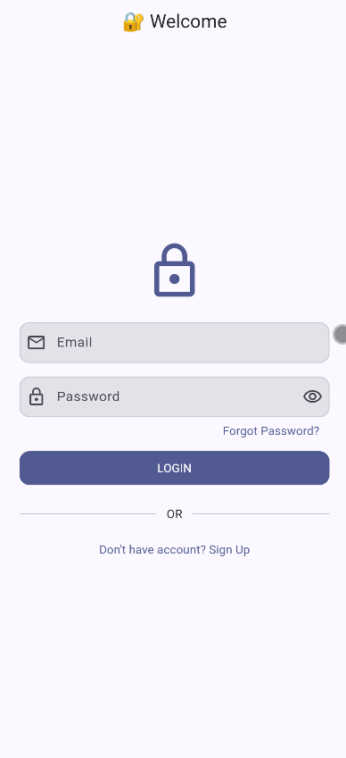
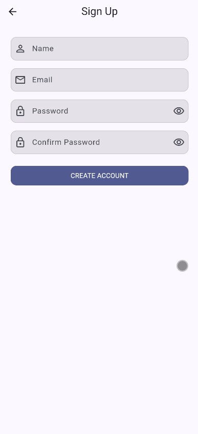
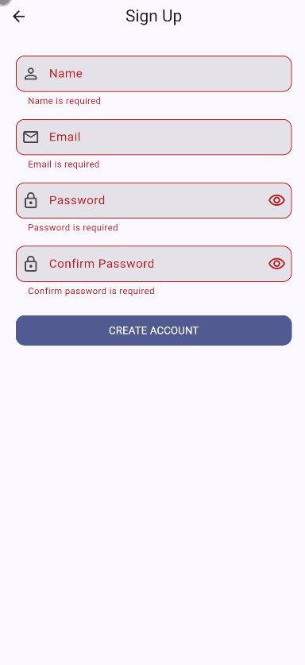
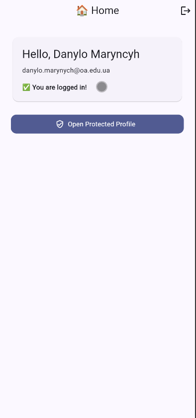
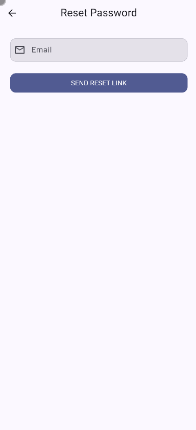
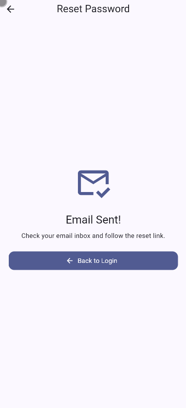
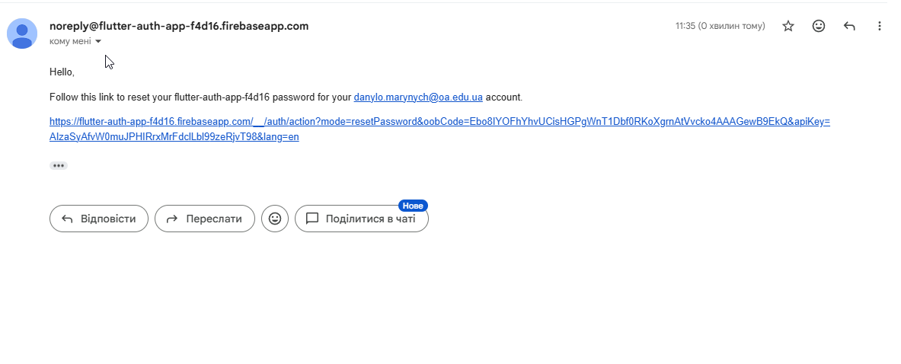
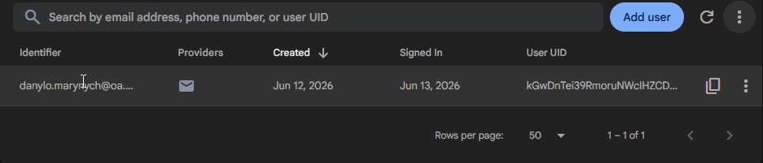

# 🔐 Лабораторна робота №16: Firebase Authentication

Виконав: Маринич Данило

---

## 📌 Про проєкт

Це Flutter-додаток для демонстрації Firebase Authentication. Додаток дозволяє користувачу зареєструватися, увійти в акаунт, вийти з акаунта, відновити пароль через email, а також автоматично зберігає стан авторизації після перезапуску застосунку.

Firebase використовується як готовий backend для авторизації: створення користувачів, вхід, вихід, скидання пароля та збереження auth-сесії виконуються через `FirebaseAuth`.

---

## ✅ Виконані вимоги

* ✅ Firebase-проєкт підключено до Flutter-додатку.
* ✅ Налаштовано FlutterFire CLI та файл `firebase_options.dart`.
* ✅ У Firebase Authentication використовується Email/Password provider.
* ✅ Реалізовано Sign Up екран з валідацією.
* ✅ Реалізовано Login екран.
* ✅ Реалізовано Logout з підтвердженням.
* ✅ Реалізовано Password Reset через email.
* ✅ Реалізовано Auth State Listener через `authStateChanges()`.
* ✅ Реалізовано Protected Route для авторизованого користувача.
* ✅ Реалізовано обробку `FirebaseAuthException` через окремий error mapper.
* ✅ UI побудовано на Material 3.
* ✅ Логіку авторизації винесено з UI в окремий service/provider.

---

## 🧱 Архітектура проєкту

```text
lib/
  main.dart
  firebase_options.dart

  core/
    theme.dart
    utils/
      validators.dart
      auth_error_mapper.dart

  features/
    auth/
      services/
        auth_service.dart
      providers/
        auth_provider.dart
      screens/
        login_screen.dart
        sign_up_screen.dart
        forgot_password_screen.dart
      widgets/
        auth_text_field.dart
        password_text_field.dart
        auth_submit_button.dart
      auth_gate.dart

    home/
      screens/
        home_screen.dart
        profile_screen.dart
```

`core/` — спільні налаштування проєкту: тема Material 3, валідатори форм і мапінг Firebase-помилок.

`features/auth/` — вся логіка авторизації: екрани входу, реєстрації, відновлення пароля, provider, service і reusable auth-віджети.

`features/home/` — екрани після входу: домашній екран і захищений профіль користувача.

`AuthService` — клас для роботи з `FirebaseAuth`: реєстрація, логін, logout, reset password і auth state stream.

`AuthProvider` — `ChangeNotifier`, який зберігає loading state, викликає `AuthService` і повертає текст помилки для UI.

`AuthGate` — головна точка перевірки авторизації, яка перемикає `LoginScreen` або `HomeScreen` залежно від стану користувача.

---

## 🔑 Основний функціонал

### Реєстрація

Користувач вводить ім’я, email, password і confirm password. Дані перевіряються через `Validators`: ім’я не може бути порожнім, email має бути валідним, пароль має містити мінімум 6 символів, а confirm password має збігатися з password.

Після успішної реєстрації в `AuthService` створюється Firebase user через `createUserWithEmailAndPassword`, після чого оновлюється `displayName` через `updateDisplayName`.

### Вхід

Користувач входить через email і password. Для входу використовується `signInWithEmailAndPassword`. Після успішного входу ручна навігація на Home не виконується, тому що `AuthGate` автоматично реагує на зміну auth state і відкриває `HomeScreen`.

### Вихід

На `HomeScreen` є кнопка logout в AppBar. Перед виходом відкривається `AlertDialog` з підтвердженням. Після виклику `signOut()` `AuthGate` автоматично повертає користувача на `LoginScreen`.

### Відновлення паролю

На `ForgotPasswordScreen` користувач вводить email. Firebase відправляє reset link на пошту через `sendPasswordResetEmail`. Після успішної відправки показується success state з текстом `Email Sent!`.

### Auth State Persistence

Стан авторизації слухається через `FirebaseAuth.instance.authStateChanges()` у `AuthGate`. Завдяки цьому після перезапуску додатку авторизований користувач залишається на `HomeScreen`, якщо Firebase сесія ще активна.

### Protected Route

`ProfileScreen` є protected screen. Перехід до нього виконується з `HomeScreen`, де додатково перевіряється `FirebaseAuth.instance.currentUser`. Якщо користувача немає, відкриття профілю не виконується і показується повідомлення.

---

## 📸 Скріншоти роботи додатку

| Login | Sign Up | Валідація |
| --- | --- | --- |
|  |  |  |

| Home | Logout dialog | Forgot Password |
| --- | --- | --- |
|  |  |  |

| Reset success | Reset email | Firebase Users |
| --- | --- | --- |
|  |  |  |

---

## ⚙️ Використані технології

* Flutter
* Dart
* Firebase Core
* Firebase Authentication
* FlutterFire CLI
* Provider
* Material 3

---

## ▶️ Як запустити проєкт

Встановити залежності:

```bash
flutter pub get
```

Запустити додаток:

```bash
flutter run
```

Якщо після зміни Firebase-конфігурації або залежностей виникають проблеми, можна виконати повне очищення:

```bash
flutter clean
flutter pub get
flutter run
```

Перед запуском потрібно перевірити у Firebase Console:

```text
Authentication -> Sign-in method -> Email/Password
```

Email/Password provider має бути увімкнений.

Firebase config-файли не потрібно комітити у публічний репозиторій. Вони мають бути згенеровані локально через FlutterFire CLI:

```bash
flutterfire configure --project=flutter-auth-app-f4d16
```

Після цієї команди мають з’явитися локальні файли:

```text
lib/firebase_options.dart
android/app/google-services.json
ios/Runner/GoogleService-Info.plist
```

Ці файли додані в `.gitignore`, бо містять client config/API key Firebase. Це не service account private key, але для публічного GitHub краще не тримати їх у репозиторії.

---

## 🔍 Як перевірити роботу

1. Запустити додаток.
2. Відкрити Sign Up.
3. Зареєструвати нового користувача.
4. Перевірити, що користувач з’явився у Firebase Console → Authentication → Users.
5. Виконати Logout.
6. Увійти через Login.
7. Перевірити Password Reset через екран Forgot Password.
8. Перезапустити додаток і перевірити, що сесія зберігається.
9. Відкрити protected Profile screen.
10. Перевірити помилки: неправильний пароль, існуючий email, слабкий пароль.

---

## 🧪 Перевірка коду

Запустити статичний аналіз:

```bash
flutter analyze
```

Поточний результат:

```text
flutter analyze
No issues found
```

Запустити тести:

```bash
flutter test
```

`flutter test` запускається для базової перевірки валідаторів і мапінгу auth-помилок. Основний акцент лабораторної зроблено на Firebase Authentication flow.

---

## 🛠️ Технічні рішення

### Чому використано Firebase Authentication?

Firebase Authentication дозволяє швидко реалізувати готову систему авторизації без написання власного backend-сервера.

### Навіщо потрібен AuthGate?

`AuthGate` слухає стан авторизації через `authStateChanges()` і автоматично показує `LoginScreen` або `HomeScreen`.

### Чому Firebase-логіка винесена в AuthService?

Так UI не працює напряму з `FirebaseAuth`. Код легше читати, підтримувати і тестувати, бо всі Firebase-виклики зібрані в одному service-класі.

### Навіщо потрібен AuthProvider?

`AuthProvider` зберігає loading state і викликає методи авторизації, щоб екрани не містили зайву бізнес-логіку.

### Як реалізовано Protected Route?

Перед відкриттям захищеного екрана перевіряється поточний користувач через `FirebaseAuth.instance.currentUser`. Якщо користувача немає, доступ не надається.

---

## ✅ Чеклист здачі

* ✅ Firebase project створено.
* ✅ FlutterFire CLI налаштовано.
* ✅ Email/Password provider увімкнено.
* ✅ Sign Up працює.
* ✅ Login працює.
* ✅ Logout працює.
* ✅ Password Reset працює.
* ✅ Auth State Listener працює.
* ✅ Protected Route реалізовано.
* ✅ Error Handling реалізовано.
* ✅ `flutter analyze` перевірено.
* ✅ README оформлено.

---

## 📌 Висновок

У результаті виконання лабораторної роботи було реалізовано повноцінну систему авторизації у Flutter-додатку з використанням Firebase Authentication. Додаток підтримує основні auth-flow сценарії, обробляє помилки користувача та зберігає стан авторизації між запусками.
